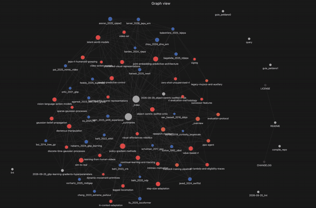

# Robot Learning Knowledge Base — User Guide

A personal research wiki compiled and maintained by an LLM (Claude Code), inspired by Andrej Karpathy's knowledge base approach. You feed it raw sources; it writes the wiki; you query the wiki; it generates outputs.

<p align="center">
  
</p>

---

## Mental Model

```
raw/          →  [LLM compiles]  →  wiki/         →  [LLM queries]  →  outputs/
papers/                             concepts/          reports/
repos/                              papers/            slides/
datasets/                           codebase/          visualizations/
images/                             comparisons/
                                    open_questions/
```

**You never edit `wiki/` directly.** The LLM owns it.  
**You never let the LLM touch `raw/`.** You own it.

---

## Setup

### 1. Prerequisites

```bash
# Obsidian (IDE frontend) — download from obsidian.md
# Open this folder as a vault: File → Open folder as vault → knowledge_base_slam/

# Recommended Obsidian plugins (install via Settings → Community plugins):
#   - Marp Slides         (render slide decks)
#   - Obsidian Git        (auto-sync with git)
#   - Dataview            (query frontmatter as a database)
#   - Web Clipper         (clip web articles to raw/papers/clipped/)

# Python 3.10+ (no extra dependencies — tools use stdlib only)
python --version
```

### 2. Obsidian Web Clipper hotkey

Install the [Obsidian Web Clipper](https://obsidian.md/clipper) browser extension.  
Set the save destination to `raw/papers/clipped/`.  
Use the "Download images" option so that images land in `raw/images/`.

---

## Daily Workflows

### Add a new paper

```bash
# 1. Copy the PDF
python tools/ingest.py /path/to/paper.pdf --type paper

# 2. Ask Claude Code to compile it
# In Claude Code terminal, paste and customize:
cat prompts/compile_paper.md
# Then say: "Compile raw/papers/pdf/paper.pdf into the wiki"
```

### Add a clipped web article

The Obsidian Web Clipper saves directly to `raw/papers/clipped/`.  
Then in Claude Code: `"Compile raw/papers/clipped/article-name.md into the wiki"`.

### Add an external codebase

```bash
git clone <repo-url> raw/repos/<name>
python tools/ingest.py raw/repos/<name> --type repo
# Then: "Compile raw/repos/<name>/ into the wiki"
```

---

## Querying the Wiki

### Simple Q&A

In Claude Code, just ask naturally — Claude will read `wiki/_summaries.md` first,
then dive into the relevant articles:

```
"Explain what is a world model"

"Compare VLA approaches against World Models + Planning"

"What are the main open questions in my research area based on the wiki?"
```

### Targeted search first (for large wikis)

```bash
python tools/search.py "latent space" --top 5
# Returns ranked wiki articles → then ask Claude to deep-read those files
```

### Generate a slide deck

```
"Create a 10-slide Marp presentation summarizing the key robot learning concepts in the wiki,
suitable for a lab meeting. Save to outputs/slides/"
```

Open the `.md` output in Obsidian → toggle Marp preview.

### Generate a comparison table

```
"Compare the five papers in wiki/papers/ on: dataset, tasks, robot platform. 
Output as a markdown table in outputs/reports/"
```

---

## Maintaining the Wiki

### Check wiki health

```bash
python tools/lint.py
```

Then optionally: `"Run a full lint pass using prompts/lint.md and fix all issues found."`

### Stats overview

```bash
python tools/stats.py
```

### File an output back into the wiki

After any Q&A session, if the output is worth keeping:
```
"File outputs/reports/2026-05-06_loop-closure-comparison.md back into the wiki
 as a new comparison article."
```

### Incremental enhancement (Karpathy-style linting)

Periodically run:
```
"Do a wiki health check. Find: (1) concepts referenced in 3+ articles with no
 dedicated article, (2) papers that contradict each other on the same claim,
 (3) open questions that could be answered from existing wiki content."
```

---

## File Naming Reference

| Source type | Where to put it | Compile command |
|-------------|----------------|-----------------|
| Paper PDF | `raw/papers/pdf/` | `"Compile raw/papers/pdf/<name>.pdf"` |
| Clipped article | `raw/papers/clipped/` | `"Compile raw/papers/clipped/<name>.md"` |
| Git repo | `raw/repos/<name>/` | `"Compile raw/repos/<name>/"` |
| Dataset | `raw/datasets/` | Describe manually or ask Claude to summarize |

Wiki output naming:
- Concept: `wiki/concepts/<kebab-case-name>.md`
- Paper: `wiki/papers/<firstauthor><year>_<shorttitle>.md`  (e.g. `mur-artal2015_orb-slam.md`)
- Codebase overview: `wiki/codebase/<name>/_overview.md`
- Comparison: `wiki/comparisons/<topic>.md`
- Open question: `wiki/open_questions/<slug>.md`

---

## Obsidian Tips

- **Graph view** — use View → Graph View to see how concepts link. Articles are color-coded by type (see `.obsidian/graph.json`).
- **Dataview plugin** — query articles by frontmatter: `TABLE type, tags FROM "wiki"` 
- **Marp preview** — open a `outputs/slides/*.md` file and enable the Marp plugin to preview slides
- **Quick Open** (Cmd+O) — fastest way to jump to any wiki article by name

---

## Prompt Templates

| Task | Template |
|------|----------|
| Compile a paper | `prompts/compile_paper.md` |
| Compile a codebase | `prompts/compile_repo.md` |
| Research query | `prompts/query.md` |
| Wiki health check | `prompts/lint.md` |

Copy the relevant template text, fill in the `{{PLACEHOLDERS}}`, and paste into Claude Code.

---

## Growing the Base (Karpathy Flywheel)

```
Add raw source
     ↓
LLM compiles → new wiki articles
     ↓
Query wiki → outputs
     ↓
File outputs back into wiki
     ↓
Lint pass → new article candidates
     ↓
(repeat)
```

Each loop the wiki gets denser and queries get better. At ~100 articles / 400K words, 
the LLM can answer complex multi-hop questions without RAG — just by reading `_summaries.md`
and the relevant subset of articles.

---

## Directory Reference

```
knowledge_robot_learning/
├── raw/                    # Your source material (you own this)
│   ├── papers/
│   │   ├── pdf/            # Paper PDFs
│   │   └── clipped/        # Obsidian Web Clipper .md files
│   ├── repos/              # Codebases from paper 
│   ├── datasets/           # Benchmark datasets, READMEs
│   └── images/             # Downloaded images from articles
│
├── wiki/                   # LLM-compiled knowledge (LLM owns this)
│   ├── _index.md           # Master article index
│   ├── _summaries.md       # 3-5 sentence summary per article
│   ├── concepts/           # Core Robot Learning concept articles
│   ├── papers/             # Per-paper summaries + analysis
│   ├── codebase/           # Code documentation
│   ├── comparisons/        # Cross-source comparison articles
│   ├── open_questions/     # Research gaps and TODOs
│   └── _attachments/       # Images referenced by wiki articles
│
├── outputs/                # LLM-generated query outputs
│   ├── reports/            # Markdown research reports
│   ├── slides/             # Marp slide decks
│   ├── visualizations/     # matplotlib / SVG figures
│   └── analyses/           # Deep-dive technical analyses
│
├── tools/                  # Python CLI utilities
│   ├── ingest.py           # Register new sources
│   ├── search.py           # Full-text search over wiki
│   ├── lint.py             # Wiki health check
│   └── stats.py            # Size/growth overview
│
├── prompts/                # Reusable LLM prompt templates
│   ├── compile_paper.md
│   ├── compile_repo.md
│   ├── query.md
│   └── lint.md
│
├── CLAUDE.md               # Instructions for the LLM
└── GUIDE.md                # This file
```
