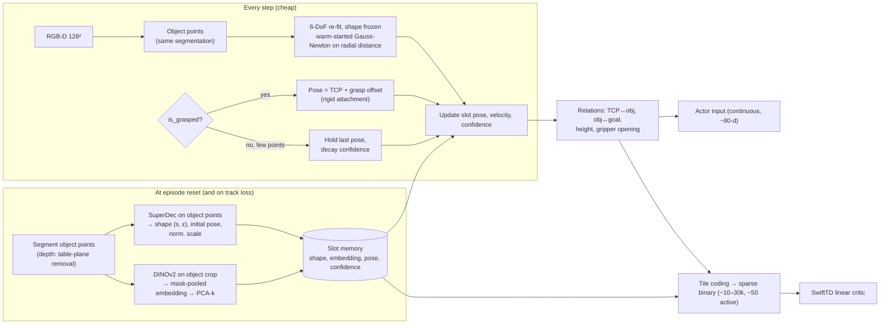

# Persistent Object-Centric Features + DINO + SwiftTD in rl_lab

## Question

How can an **object-centric, persistent representation** like SuperDec's be used inside a learning setup like **rl_lab** (PPO on ManiSkill `PickCubeSO100-v1`, frozen evaluation protocol)? The goal is to combine two things:
- a **physical sense of the world** from DINO embeddings;
- **efficient selection of useful features** in the way SwiftTD does it.

## Short Answer

Organise the observation into **persistent object slots** and split the work by how fast each quantity changes:

| What | Changes how fast | Computed with | When |
|---|---|---|---|
| Object **shape**: superquadric scales and exponents (SuperDec) | Never, for rigid objects | SuperDec forward pass (+ optional LM refinement) | **Once per episode** (and on track loss) |
| Object **identity and semantics**: DINO embedding pooled inside the object mask | Never | DINOv2 on an object crop | **Once per episode** |
| Object **pose and velocity** | Every step | Cheap 6-DoF re-fit with the shape frozen, or rigid attachment to the gripper while grasped | **Every step** |
| **Relations** (gripper↔object, object↔goal, grasp state) | Every step | Arithmetic on the poses above | **Every step** |

Then give the two networks different views of the same slots:
- **The actor (MLP)** receives a compact continuous slot vector (~80 dims).
- **The SwiftTD critic (linear)** receives a **sparse binary tile coding** of the low-dimensional relational quantities, plus a coarse coding of the slot's DINO components.

This coding is the regime SwiftTD was actually validated in: 201k *binary sparse* features with a linear learner. Its per-feature step sizes and credit, $\sum_t e^{\beta_t[i]}\phi_t[i]^2$, then read as **"which object × which relation × which range matters for value"**, which is a far more interpretable form of feature selection than credit spread over 3,456 correlated DINO grid dimensions.

Two things make this worth doing:
- **Persistence** fixes the occlusion problem during grasping, which the Stage-1 guide lists as a risk ("a single base camera may not see the grasp well").
- **Moving the expensive perception to episode reset** avoids most of the ~3.5× per-sample cost of running DINO every step. This is an estimate; see §4.

Three honest caveats up front:
1. For a **single cube**, SuperDec is overkill: one box-shaped superquadric *is* the answer, and this pipeline mostly **reconstructs the privileged `obj_pose` from depth**. The approach shows its value with multiple, unknown-shape or articulated objects, i.e. Stage 4 tasks (stacking, peg insertion).
2. It changes rl_lab's research question from "SwiftTD on *frozen foundation-model features*" to "SwiftTD on *structured object-centric features*". It should be a **separate arm**, not a silent redesign of Stage 1.
3. **Running SwiftTD across 1,024 parallel environments is an open implementation problem** (§3.4), and neither the paper nor the package addresses it.

---

## 1. What Each Ingredient Actually Contributes

### SuperDec: compactness and persistence, not physics

From [Fedele et al. (2025)](../../wiki/papers/fedele_2025_superdec.md):
- **What it gives you:**
  - ~12 numbers per primitive: scale 3, shape exponents 2, rotation 3, translation 3, existence 1.
  - A **closed-form radial distance** to the surface, so re-fitting a pose, checking collisions or computing contact proximity is cheap.
  - Class-agnostic decomposition that generalises from ShapeNet to noisy partial scans (ScanNet++ L2 0.11 vs 0.41 for the next best method).
  - An analytic grasp prior via superquadric grasp planners.
- **Speed:** 256 objects per forward pass on an RTX 4090, ~0.13 s per full Replica scene, each LM refinement step under 1 s. That is fine **once per episode** and too slow for **every step × 1,024 envs**.
- **What it does *not* give you:**
  - dynamics or physical parameters (mass, friction);
  - persistence by itself: SuperDec is a single-frame method, so persistence is something *you* add by storing and tracking slots.
- **Relevant quirk:** each instance is normalised to a sphere of radius 0.5 before decomposition. **The normalisation scale and centroid must be kept as features**, or absolute size is lost.

### DINO: a spatially resolved prior for "what is where", not measured physics

From [DINO-WM](../../wiki/papers/zhou_2024_dino_wm.md) and [Pretrained Visual Representations](../../wiki/concepts/pretrained-visual-representations.md):
- DINOv2 **patch** features carry enough information that a small predictor learns contact-rich dynamics from them (Push-T 0.90 vs 0.44 for CLS). **Spatial structure is the key ingredient**, so global vectors collapse.
- "Physical sense" here means **a representation from which dynamics are learnable**. It does **not** mean physical parameters are encoded: DINO-WM's PushObj generalisation to unseen shapes stayed at 0.34.
- In a slot design, DINO's job shifts. It stops being the carrier of geometry (depth and superquadrics do that better and cheaper) and becomes:
  1. **identity** for re-associating a slot after occlusion or crossing;
  2. **semantics and material/affordance cues** that geometry cannot provide (which part is the handle, what the object is), which matter in multi-object tasks.

### SwiftTD: step sizes as a relevance detector, under specific conditions

From [SwiftTD](../../wiki/papers/javed_2024_swifttd.md) and [Step-Size Adaptation](../../wiki/concepts/step-size-adaptation.md):
- Per-feature $\alpha_i = e^{\beta_i}$ are meta-learned (IDBD-style). Irrelevant features' step sizes are driven down (Sutton 1992: 15 irrelevant rates fell below 0.007), and normalisers like Adam cannot do this.
- **Conditions under which that evidence was obtained:**
  - linear prediction;
  - **binary sparse features**;
  - **fixed policy** (prediction, never control);
  - γ = 0.98.
- **Consequences for design:**
  - Step-size selection is *soft*: a feature with a tiny α still contributes through its (now frozen) weight. Hard selection requires thresholding credit.
  - The derivation assumes $\partial w_j/\partial\beta_i \approx 0$, i.e. little interaction between inputs. **Highly correlated inputs** such as neighbouring DINO dimensions or pooled regions **split credit arbitrarily**, so the credit map becomes hard to read.
  - Credit scales with $\phi^2$, so **feature scaling decides who gets credit**. With binary features this is a non-issue; with continuous DINO features it depends on the frozen normaliser.

**Conclusion of §1:** SwiftTD's feature selection works best on **many sparse, weakly correlated features, each with a clear meaning**. Object slots plus tile coding produce exactly that. A dense pooled DINO grid does not.

---

## 2. Proposed Architecture: a Persistent-Slot Env Wrapper

This follows rl_lab's Stage-1 rule: **perception is a vec-env wrapper**, so `PPOAgent` and `rl/evaluation.py` stay byte-identical ([Research Roadmap](../../wiki/codebase/rl_lab/research-roadmap.md)).

### 2.1 Segmentation: keep it non-privileged

- **Ground-truth sim segmentation** would be easiest, but it tells the policy exactly which pixels are the cube. That is privileged *object* information, which Stage 1's contract forbids.
- **Non-privileged option that fits this task:** fit a table plane to the depth image and keep the points above it that are not on the robot, since robot link poses are known from proprioception. The Stage-1 guide itself notes that "a cube on a flat table is almost trivial to segment by depth". It is cheap and batched on the GPU.
- **Keep GT segmentation as an explicit oracle arm** (§4) so the cost of segmentation errors can be measured separately.
- For multi-object or real-world tasks later, swap in a class-agnostic segmenter (SuperDec uses Mask3D; see the SuperDec paper for alternatives).

### 2.2 Persistent shape memory (SuperDec at reset)

- **At reset:**
  1. Back-project the object's depth pixels to a point cloud, then centre and rescale it to radius 0.5 (SuperDec's convention).
  2. Resample to SuperDec's input size (4,096 points; farthest-point vs random sampling made little difference).
  3. Run the forward pass, optionally with a few LM rounds.
  4. Store `(s, ε)` per primitive, the normalisation scale, and the initial pose.
- **Cost estimate:** 1,024 objects ≈ 4 batches of 256, i.e. well under a second per iteration of 50 steps. Compare ~4.84 s/iteration for bf16 DINO on every frame. This is an **estimate** extrapolated from SuperDec's 4090 figure; measure it.
- **For the cube,** expect one primitive with small ε (box-like). A direct box fit (5 parameters by LM) is the cheap baseline SuperDec must beat to justify itself.

### 2.3 Per-step pose tracking (the "persistent" part)

- **While the object is visible:** warm-start from the previous pose and run 2–5 Gauss–Newton steps on SuperDec's own LM residual (the radial distance of the object's points to the superquadric) **with shape frozen**, i.e. 6 unknowns per object. This is batched and trivial on the GPU.
- **While grasped** (`is_grasped`, already a documented concession in the contract): **attach the object rigidly to the TCP**, storing the grasp offset at grasp onset. This covers exactly the phase where the gripper occludes the cube.
- **When there are too few points and no grasp:** hold the last pose and **decay a confidence feature**. The policy must be able to know the memory may be stale. Without a confidence signal, persistence can hallucinate a cube that has fallen.
- **Velocity:** a finite difference of tracked poses, or a small Kalman filter. Rigid-body motion makes a constant-velocity filter reasonable over 1–3 frames.

### 2.4 DINO slot embedding (also at reset)

- **Resolution problem:** at the planned 126² render, the 9×9 patch grid means a small cube covers **about one patch or less**. Mask-pooling the full-frame grid gives a nearly single-patch embedding polluted by the background.
- **Fix:** crop a region of interest around the projected object bounding box and run DINOv2 on the crop (e.g. 56² gives 4×4 patches, or 126²), then mask-pool.
- For rigid objects the embedding is **persistent**, so compute it once per episode. Re-run it only on track loss, or if the task involves appearance change (articulation, deformation).
- **Reduce it with PCA** (k ≈ 8–16) fitted once on reset frames and **frozen**, following the same frozen-normaliser rule as Stage 1.
- **Uses:**
  - re-identifying the slot after occlusion (cosine similarity plus pose gating, Hungarian matching if there are several objects);
  - a semantic input to the actor;
  - coarse-coded features for the critic.

### 2.5 Actor input (continuous, ~80-d)

- 23-d proprioception and goal (unchanged from the Stage-1 contract).
- Slot:
  - shape: `s` 3, `ε` 2, normalisation scale 1;
  - position relative to TCP 3 and to goal 3;
  - orientation as a 6-D rotation;
  - linear velocity 3;
  - confidence 1;
  - DINO-PCA 8–16.

**Why keep the full vector for the actor:** the actor is an MLP, so it can use continuous inputs directly. Relational encodings (relative positions) are the main inductive bias; SwiftTD selection is not needed here.

### 2.6 Critic input: tile coding for SwiftTD (sparse binary)

Tile-code the **low-dimensional relational quantities** (the illustrative budget below should be measured and adjusted):

| Tile set | Variables | Illustrative size |
|---|---|---|
| Conjunction A | $d(\text{TCP},\text{obj})$, $d(\text{obj},\text{goal})$, object height $z$ — separate tile sets for `is_grasped` = 0/1 | 8 tilings × 10³ × 2 ≈ 16k |
| Conjunction B | gripper opening × $d(\text{TCP},\text{obj})$ | 8 × 10² ≈ 800 |
| Singles | each joint angle, each relative-position component, confidence | ~20 × 8 × 16 ≈ 2.5k |
| Semantic | each DINO-PCA component (coarse, 1-D) | 16 × 4 × 8 ≈ 500 |
| Bias | 1 | 1 |

That gives ~20k binary features with ~50 active per step, the same regime as the Atari Prediction Benchmark. Use SwiftTD's **sparse** variant, not `SwiftTDNonSparse`.

This also addresses the capacity problem the γ pilot exposed: **a linear function of the raw 36-d privileged state explains only R² ≈ 0.45 of the Monte-Carlo return at γ = 0.95** ([Training Pipeline](../../wiki/codebase/rl_lab/maniskill-training-pipeline.md)). A linear critic on raw continuous slot parameters would inherit that ceiling. Tile coding over relations is the classic way to give a linear learner the needed nonlinearity (value depends on distances and on conjunctions like "grasped **and** near goal").

---

## 3. Feature Selection with SwiftTD: What You Get and How to Use It

### 3.1 Soft selection comes for free
Each tile's $\alpha_i$ rises if its weight keeps being corrected in the same direction and falls if not. The step-size decay handles overshoot.

### 3.2 An interpretable credit map
Aggregate lifetime credit $\text{Credit}_i = \sum_t e^{\beta_t[i]}\phi_t[i]^2$ **by tile set and by region of relational space**. Expected readable outcomes:
- credit concentrating on "grasped ∧ small $d(\text{obj},\text{goal})$";
- little credit on joint-angle singles;
- near-zero credit on DINO-PCA components *for this single-cube task*. That would itself be a finding: semantics is irrelevant here, and it would **predict** that semantics becomes relevant in multi-object tasks.

This is an object-level version of the "credit heatmap" planned in the roadmap. It can still be projected back onto the image by rendering the slot's superquadric, coloured by its aggregate credit.

### 3.3 Hard selection, if you want it
After a warm-up of N env-steps, drop tiles whose credit falls below a quantile, or **pass credit-selected relations to the actor**. The second option is a concrete, cheap version of Stage 4's "per-feature step sizes in the actor", and it keeps the actor out of meta-learning. Pre-commit the threshold and warm-up length.

### 3.4 The batched-stream problem (unsolved)

SwiftTD is a **single-stream online** algorithm: eligibility traces, the IDBD trace $h$, and the overshoot bound per update. rl_lab runs **1,024 envs**. Options:

| Option | Faithful to SwiftTD? | Data efficiency | Risk |
|---|---|---|---|
| (a) One SwiftTD instance per env | Yes | Each critic sees 1/1,024 of the data | 1,024 separate critics, poor estimates |
| (b) Shared $w$, $\beta$; per-env traces $z$, $h$; sum updates across envs each step | No; new algorithm | High | The correction-ratio bound is per update, and summing 1,024 updates can overshoot even if each is bounded. **Untested** |
| (c) Train SwiftTD on a **subset of streams** (e.g. 8–32 envs, interleaved), use it to predict V for all 1,024 for GAE | Yes, per stream | Medium; prediction is cheap, learning sees fewer samples | Critic lags; fine if SwiftTD is as sample-efficient as claimed |

**Recommendation:** start with (c). It is faithful to the algorithm, so results are attributable to SwiftTD, not to a batching hack. Treat (b) as a separate research contribution. Note also that the official package is a C++ CPU implementation, so (b) would need a GPU reimplementation.

> **Verify:** the SwiftTD paper never uses parallel streams or control. PPO's changing policy makes the value target non-stationary, which SwiftTD's tracking orientation should help with, but this is untested.

---

## 4. How It Fits rl_lab Without Breaking the Protocol

### De-risk offline first (cheap, days not weeks)

1. **Capacity check.** Replay the γ-pilot methodology: roll out the frozen privileged policy (seed-44 iteration 2,500) and compute held-out R² of the Monte-Carlo return-to-go at γ = 0.95 for:
   - (i) raw 36-d linear (known: 0.45);
   - (ii) tile-coded privileged relations;
   - (iii) tile-coded **perceived** relations from the slot wrapper.
   
   **Pre-commit:** if (iii) is not clearly above 0.45, the linear-critic premise fails on these features. Fix the features before any RL run.
2. **SwiftTD in prediction mode.** Run SwiftTD on the same logged streams under a fixed policy (exactly the paper's setting) and measure lifetime error and credit maps. This separates "does SwiftTD select sensible features here" from "does it survive PPO".
3. **Tracking accuracy.** Pose error of the slot tracker against the ground-truth `obj_pose`, split by phase (free / occluded / grasped). This bounds how close the object-centric arm can get to the privileged baseline.

### Online arms (same PPO, same `evaluate()`, 3 seeds, ties under 0.06)

| Arm | Actor input | Critic | Purpose |
|---|---|---|---|
| P (done) | Privileged 36-d | MLP | Upper bound: 0.909 ± 0.030 |
| G (Stage 1 plan) | DINO grid 3×3 + depth, 3,560-d | MLP | Planned visual baseline |
| **O-oracle** | Slots with **GT segmentation** | MLP | Cost of representation only (a concession arm, labelled as such) |
| **O** | Slots with depth-plane segmentation | MLP | Honest object-centric policy |
| **O-S** | Slots | **SwiftTD on tile coding**, option (c) | The research question, object-centric form |
| G-S (Stage 2 plan) | DINO grid | SwiftTDNonSparse | The research question as planned |

Expected pattern, written down as hypotheses to pre-commit, not results:
- O-oracle ≈ P, because the slot pose reconstructs `obj_pose`.
- O is within ~0.1 of O-oracle.
- O ≥ G on success and **≪ G on wall-clock**, because the expensive perception runs at reset.
- O-S is interpretable in a way G-S is not.

If O-oracle is clearly below P, **tracking or occlusion handling is the bottleneck**. That is informative and cheap to diagnose using offline step 3.

### Compute (estimate, must be measured)

| Component | s/iteration (51,200 env-steps) |
|---|---|
| Simulation + RGB-D render 126² | ~3.4 (measured in the guide at 128²) |
| SuperDec + DINO crop at reset (1,024 objects) | < 1 (extrapolated) |
| Per-step segmentation + pose re-fit | small (batched arithmetic; measure) |
| PPO update | ~1.85 |
| **Total** | **~6 s** vs ~10.1 for the per-step DINO grid (G) and 2.9 for privileged (P) |

The render is now the dominant cost, not the encoder. **Log `time/encoder_s`** as the guide already plans.

---

## 5. Risks and Caveats

- **SuperDec on tiny partial views is out of distribution.** It was trained on full ShapeNet objects. At 126² a small cube yields perhaps tens to a few hundred depth points from one side. The ScanNet++ partial-scan results are encouraging but involve much larger objects. **Measure the fit quality; fall back to a direct box or superquadric LM fit** if SuperDec adds nothing for a cube.
- **Stale memory.** Persistence can hallucinate. Keep the confidence feature, and re-run reset perception on track loss (e.g. when the pose residual jumps).
- **Scope creep.** `plan_swifttd_percepcion.md` rates this risk "Alta (te conozco)" (high — I know you). This design is a new branch. Two honest placements:
  1. **As one extra Stage-1 arm (O)**, justified by the occlusion risk and the compute budget, with O-S deferred to Stage 2 alongside G-S.
  2. **As Stage 4 material** (multi-object tasks), where SuperDec's generality and DINO semantics actually matter.

  Do **not** redesign Stage 1 around it without first running the offline de-risking steps.
- **Claims.** The honest claim is "no privileged object state; segmentation from depth geometry; `goal_pos` and `is_grasped` retained as documented". The O-oracle arm must be labelled as privileged.
- **Tile-coding hyperparameters** (tilings, ranges, conjunction choice) are hand design. SwiftTD's step sizes compensate partly, which is one of the claims being tested, but ranges set from privileged-state statistics leak nothing at test time only if they are frozen before training.

## 6. Recommendation

1. Finish Stage 1's **grid arm (G)** as planned, since the protocol and budget are already set, and add **arm O** only if the offline capacity check passes.
2. **Build the slot wrapper incrementally:**
   - depth-plane segmentation → box/superquadric fit at reset → per-step pose re-fit → grasp attachment → confidence;
   - SuperDec and DINO-crop embeddings last, each justified by a measured gain over the simpler version.
3. **In Stage 2, run SwiftTD in prediction mode on logged data first**, then O-S with option (c), alongside the planned G-S.
4. **Save the full SuperDec + DINO-semantics slot design** for the multi-object Stage-4 tasks, where it earns its cost.

---

## Sources Used

- [Fedele et al. (2025) — SuperDec](../../wiki/papers/fedele_2025_superdec.md) and [Superquadric & Primitive-Based Scene Representations](../../wiki/concepts/superquadric-scene-representations.md): parameterisation, radial distance, LM residuals, speed, normalisation, partial-scan generalisation
- [Zhou et al. (2024) — DINO-WM](../../wiki/papers/zhou_2024_dino_wm.md) and [Pretrained Visual Representations](../../wiki/concepts/pretrained-visual-representations.md): patch ≫ CLS, dynamics learnability, novel-shape limits
- [Javed et al. (2024) — SwiftTD](../../wiki/papers/javed_2024_swifttd.md), [Step-Size Adaptation](../../wiki/concepts/step-size-adaptation.md), [Sutton (1992) — IDBD](../../wiki/papers/sutton_1992_idbd.md): per-feature step sizes, credit, validated regime, cross-input approximation
- [rl_lab Research Roadmap](../../wiki/codebase/rl_lab/research-roadmap.md), [Training Pipeline](../../wiki/codebase/rl_lab/maniskill-training-pipeline.md), [Evaluation Protocol](../../wiki/codebase/rl_lab/evaluation-protocol.md): observation contract, wrapper rule, compute measurements, R² analysis, detection threshold
- [RL Evaluation Methodology](../../wiki/concepts/rl-evaluation-methodology.md): pre-commitment and arm design

## Gaps Identified

1. **No object-centric RL or slot-tracking paper in the wiki.** Slot attention, SlotFormer and object-centric world models would inform §2.3–2.4. The design here is assembled from first principles.
2. **No compiled source on SwiftTD with parallel streams or control.** §3.4 is untested territory.
3. **No wiki source on tile coding specifically.** It is standard (Sutton & Barto, ch. 9), but not compiled.
4. **RMA** (uncompiled `raw/papers/pdf/RMA.pdf`) is relevant to a related question: whether history-based implicit estimation could replace explicit slot velocity and physical parameters.

## Follow-up Questions

- Does credit on DINO-PCA components become non-zero in a two-object task where identity matters (pick *the red* cube)? That would be a clean test of "semantics is selected only when needed".
- Could the slot memory feed a **DINO-WM-style predictor over slots** (an object-centric latent world model) for planning, reusing the same persistent state?
- Is `is_grasped`-based rigid attachment still valid when the grasp slips? A tracked residual could detect that and also replace the `is_grasped` concession.
