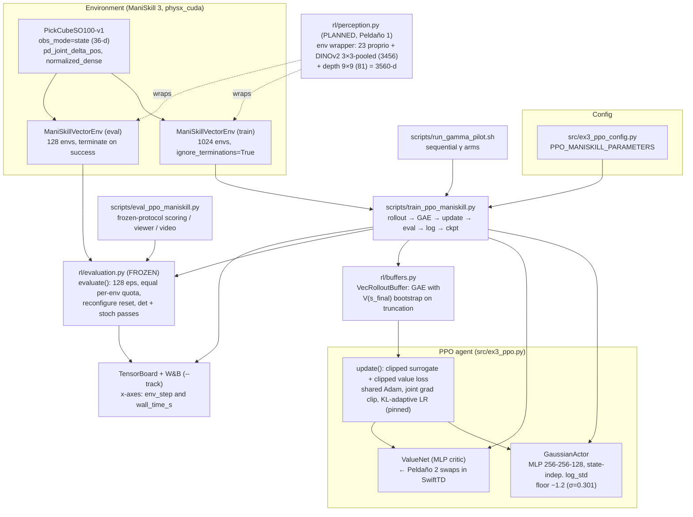

# rl_lab — Codebase Overview

**What it is:** a personal research repo (git history 2026-06-30 → 2026-09-29, HEAD `9b6cd05 "WIP: planning stage 1"`). It trains a **from-scratch PPO** agent for **pick-and-place with the SO-100 / LeRobot arm** in **ManiSkill 3** (`PickCubeSO100-v1`, 1,024 GPU-parallel envs). It wraps that agent in a **frozen evaluation protocol** that serves as the measuring instrument for a staged research plan:

> *Can a linear critic trained with **SwiftTD** on frozen foundation-model features (**DINOv2 + depth**) match or beat a standard deep critic for value learning in manipulation — with less compute, no replay, learning online?*

The repo grew out of a set of RL course exercises (`src/ex{1..4}_*`, MDP/DQN/PPO/SAC); the MDP and DQN code was removed in `68bd537`. `README.md` is empty ("under construction..."). The substantive documentation lives in `PROTOCOL.md`, `plan_swifttd_percepcion.md` and `guia_peldano{0,1}.md`. The planning documents are in Spanish; the code and `PROTOCOL.md` are in English.

## Status (as of HEAD)

| Stage ("Peldaño") | Status |
|---|---|
| 0 — Evaluation infrastructure + privileged baseline | **Closed.** Protocol frozen; γ = 0.95 decided; 3-seed baseline **0.909 ± 0.030** deterministic success |
| 1 — Realistic perception (privileged → DINOv2 + depth) | **Planning** (`guia_peldano1.md`); no perception code exists yet (`rl/perception.py` is planned) |
| 2 — SwiftTD linear critic | Not started |
| 3 — Write-up | Not started |
| 4 — Extensions (per-feature step sizes in the actor, Genesis, more tasks) | Frozen until 1–3 close |

## Architecture

## Components

| Component | Files | Article |
|---|---|---|
| PPO agent: actor/critic networks, update, buffers | `src/ex3_ppo.py`, `rl/networks.py`, `rl/buffers.py`, `rl/common.py` | [PPO Agent](ppo-agent.md) |
| ManiSkill training pipeline: env construction, rollout loop, logging, γ pilot | `scripts/train_ppo_maniskill.py`, `src/ex3_ppo_config.py`, `scripts/run_gamma_pilot.sh`, `scripts/eval_ppo_maniskill.py` | [ManiSkill Training Pipeline](maniskill-training-pipeline.md) |
| Frozen evaluation protocol + baseline results | `rl/evaluation.py`, `PROTOCOL.md` | [Evaluation Protocol](evaluation-protocol.md) |
| Research plan: stages 0–4, observation contract, compute budget, SwiftTD critic design | `plan_swifttd_percepcion.md`, `guia_peldano0.md`, `guia_peldano1.md` | [Research Roadmap](research-roadmap.md) |
| Legacy MuJoCo SO-100 env, SAC exercise stub, Genesis experiments, JEPA/SIGReg utility | `envs/*`, `scripts/{train,eval}_{ppo,sac}.py`, `src/ex4_sac*.py`, `utils/train_jepa.py`, `assets/mujoco/` | [Legacy MuJoCo & Auxiliary Code](legacy-mujoco-and-auxiliary.md) |

## Key Design Decisions (with the evidence the repo records)

1. **The evaluation module is frozen before any experiment.** Every stage imports `rl.evaluation.evaluate` unchanged ([Evaluation Protocol](evaluation-protocol.md)).
2. **Training envs ignore terminations**, so success keeps paying. Otherwise grasp-and-stall (0.53/step forever) was worth more than finishing ([ManiSkill Training Pipeline](maniskill-training-pipeline.md)).
3. **A hard floor on the policy log-std (−1.2, σ = 0.301)** rather than an entropy bonus. Without it, σ collapsed within ~150 iterations and the agent learned to pick but never to place ([PPO Agent](ppo-agent.md)).
4. **γ = 0.95 instead of ManiSkill's 0.8.** This roughly doubles success (0.45 → 0.91 deterministic), triples sample efficiency, and makes value learning non-trivial, which the SwiftTD study needs.
5. **Perception will be an env wrapper, not part of the agent** (planned). The agent and `evaluate()` then stay byte-identical, and the SwiftTD critic sees exactly the actor's input vector ([Research Roadmap](research-roadmap.md)).

## Environment and Dependencies

- `torch>=2.0`, `gymnasium>=0.29`, `mani_skill>=3.0.0`, `mujoco`, `wandb>=0.17`, `tensorboard==2.20.0`, `moviepy`, `pygame`.
- `genesis` is imported by `envs/` but **missing from `requirements.txt`**. `sklearn` and `tensordict` are also used but unlisted.
- **Hardware:** the baseline ran on a single **RTX A6000** (host "Asimov"). The plan assumes 8× RTX 2080 for a later multi-GPU cluster stage, which is explicitly postponed.

## Concept Links

- [Policy Gradient Methods](../../concepts/policy-gradient-methods.md): PPO, GAE, clipping
- [RL Evaluation Methodology](../../concepts/rl-evaluation-methodology.md): the protocol's lessons generalised
- [Step-Size Adaptation](../../concepts/step-size-adaptation.md), [TD(λ) & Eligibility Traces](../../concepts/td-lambda-and-eligibility-traces.md) and [Javed et al. (2024) — SwiftTD](../../papers/javed_2024_swifttd.md): the Peldaño 2 critic
- [Pretrained Visual Representations for Robotics](../../concepts/pretrained-visual-representations.md): the Peldaño 1 DINOv2 feature design
- [Sim-to-Real Transfer](../../concepts/sim-to-real.md) and [Legged Locomotion](../../concepts/legged-locomotion.md): the teacher–student distillation used as Plan B

## See Also

- [PPO Agent](ppo-agent.md)
- [ManiSkill Training Pipeline](maniskill-training-pipeline.md)
- [Evaluation Protocol](evaluation-protocol.md)
- [Research Roadmap](research-roadmap.md)
- [Legacy MuJoCo & Auxiliary Code](legacy-mujoco-and-auxiliary.md)
- [RL Evaluation Methodology](../../concepts/rl-evaluation-methodology.md)
- [Open question: Object-Centric Persistent Slots + SwiftTD Critic](../../open_questions/object-centric-swifttd-critic.md)
